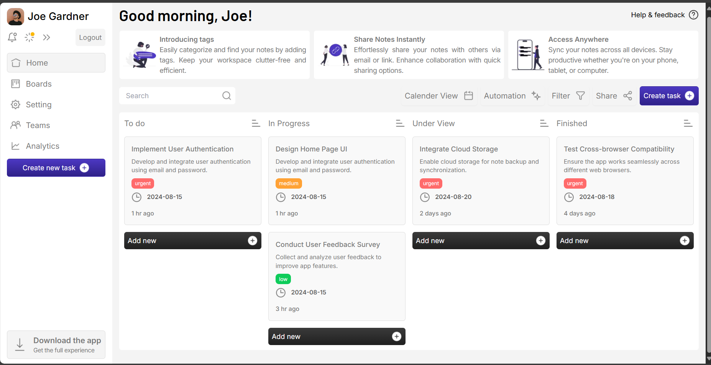
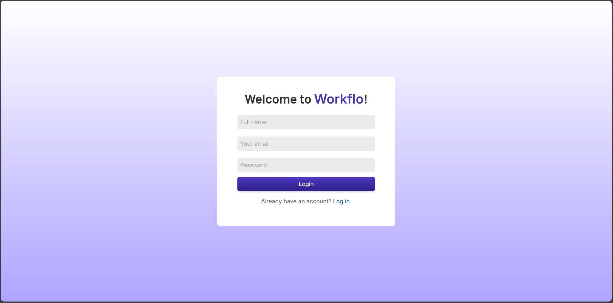
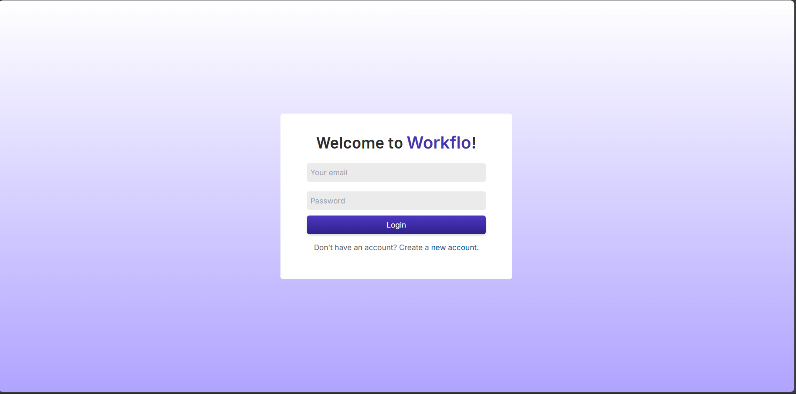
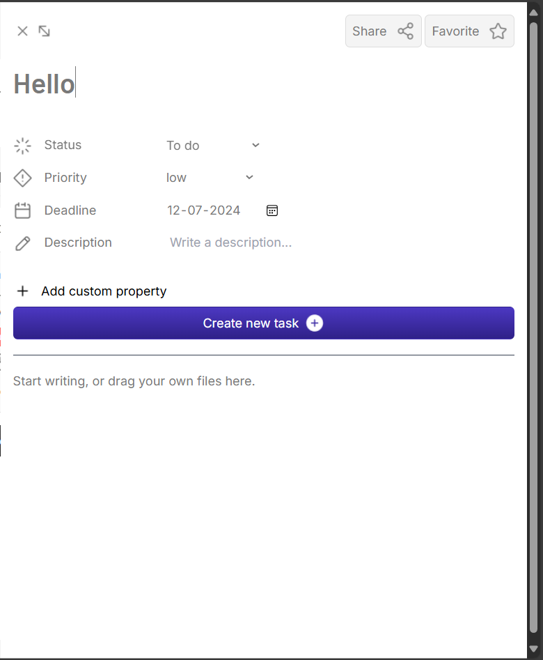

### **Project Name**: Next.js Todo App with Authentication & Rich UI

#### **Project Motto**:
"Organize tasks efficiently with secure access and a seamless user experience."

---

### **Project Description**:
A fully featured Todo application built with Next.js, React, and Mongoose, offering secure user authentication and a rich user interface. This app allows users to create, edit, and manage tasks seamlessly, leveraging Next-Auth for authentication, React Hook Form for efficient form handling, and TinyMCE for rich text editing. The app is designed to deliver a responsive, intuitive UI, allowing users to keep track of tasks with ease.

---


# Next.js Todo App with Authentication & Rich UI

## Description
This project is a robust Todo application developed with Next.js and React, designed for secure and seamless task management. Integrated with Mongoose for MongoDB data management, Next-Auth for user authentication, React Hook Form for streamlined form processing, and TinyMCE for rich text capabilities, it delivers a high-quality, user-centric experience.

## Features
- **User Authentication**: Sign up, log in, and secure task management with Next-Auth.
- **Task Management**: Create, view, edit, and delete tasks in an organized and efficient interface.
- **Rich Text Support**: Add detailed descriptions and notes with TinyMCE’s rich text editor.
- **Efficient Forms**: Form handling with React Hook Form for seamless and error-free task creation and updates.
- **Responsive UI**: A smooth and responsive UI, ensuring a consistent experience across all devices.

## Installation

1. **Clone the repository**:
   ```bash
   git clone git@github.com:manav-01/todo-app.git
   cd nextjs-todo-app
   ```

2. **Install dependencies**:
   ```bash
   npm install
   ```

3. **Environment Variables**:
   Create a `.env.local` file in the root directory and add the following variables:

   ```plaintext
   MONGODB_URI=your_mongo_connection_string
   NEXTAUTH_URL=http://localhost:3000
   NEXTAUTH_SECRET=your_nextauth_secret
   ```

4. **Run the application**:
   ```bash
   npm run dev
   ```

   Your app should now be running at `http://localhost:3000`.

## Tech Stack
- **Next.js** for the application framework
- **React** for the front-end
- **Mongoose** for MongoDB integration
- **Next-Auth** for authentication
- **React Hook Form** for efficient form management
- **TinyMCE** for a rich text editor in task descriptions

## Usage
1. **Register/Login**: Use Next-Auth to register or log in securely.
2. **Manage Tasks**: Create new tasks with detailed descriptions, view them, edit as necessary, and delete when completed.
3. **Rich Text Editor**: Leverage TinyMCE to format task details with bullet points, highlights, and more.

## Contribution
Feel free to fork this repository, create feature branches, and submit pull requests. Your contributions are welcome!

## License
This project is open-source and available under the MIT License.


## Demo









